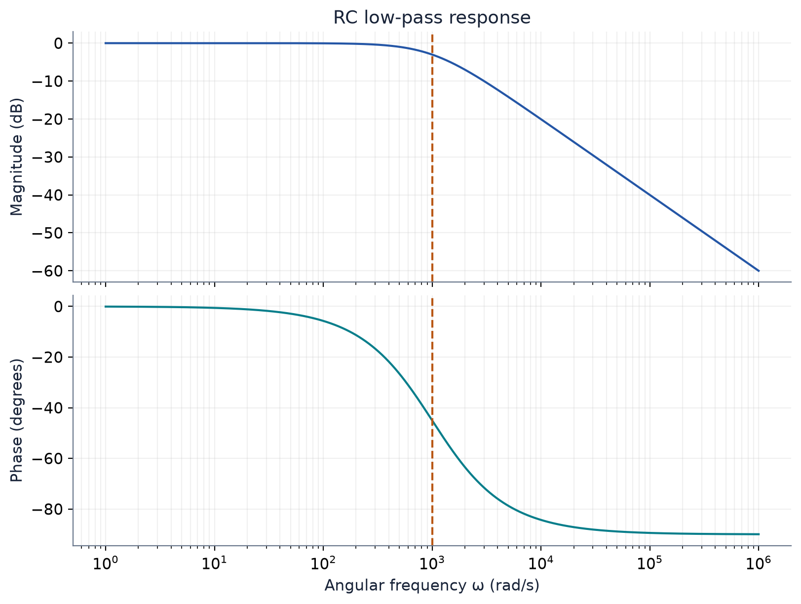
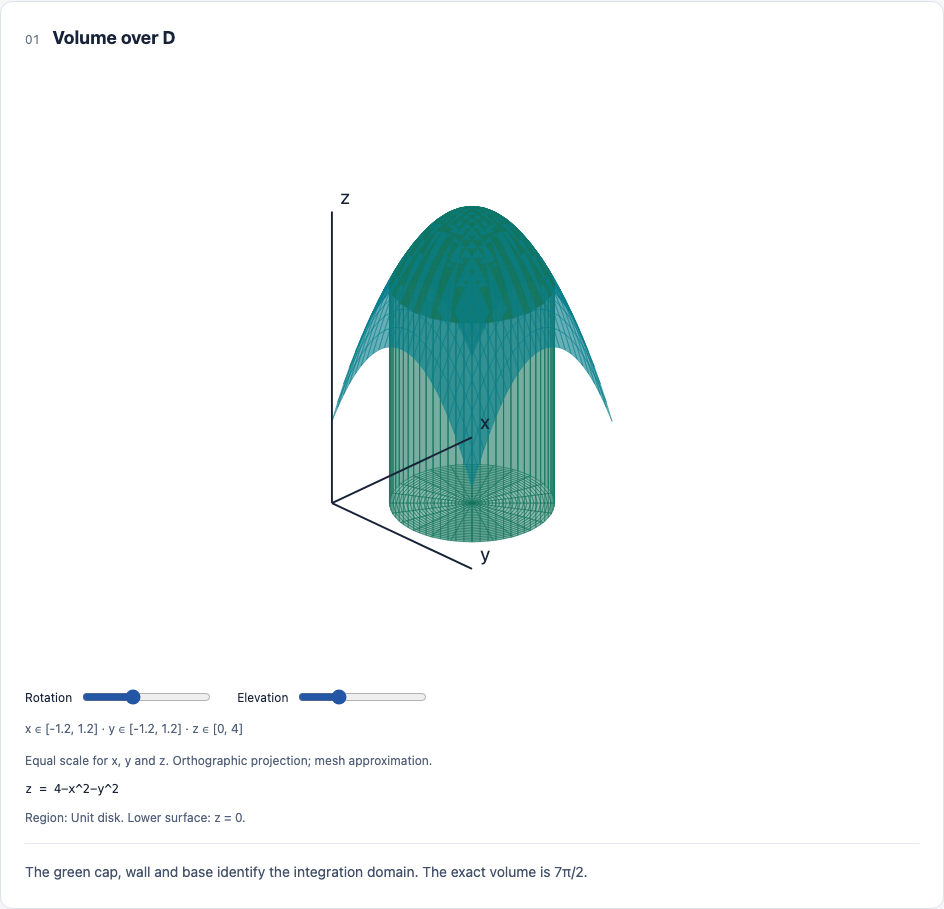

# Studai STEM

**Editable STEM illustrations for Claude Code and Codex, with equations and checks you can inspect.**

Turn a problem statement into a mathematical model, a clear figure, and a reproducible
source file. Studai includes 45 examples across math, algorithms, physics and electrical
engineering, 19 native diagram types, and six scientific Python recipes.



The native renderer needs **Node.js 22+**. It works locally without npm installation,
a model API key, a server, or a network connection. HTML includes its own interactive
controls; SVGs remain editable. Python recipes add PDF and high-resolution PNG exports.

## Install into a project

```sh
git clone https://github.com/adam-shlomo/studai-stem.git
cd studai-stem
node scripts/install.mjs --agent both --project /path/to/your/course-project
```

This installs the same self-contained skill into `.claude/skills/studai-stem` and
`.agents/skills/studai-stem`. Use `--agent claude` or `--agent codex` for one host.
For personal installation across projects, replace `--project ...` with `--user`.
The installer refuses existing installations; it does not change host settings.

Start or refresh the agent session, then ask:

**Claude Code**

```text
/studai-stem Illustrate the volume under z = 4 − x² − y² over the unit disk.
Show the domain and verify the integral.
```

**Codex**

```text
$studai-stem Draw a full adder, verify every truth-table row, and give me an SVG.
```

You can also ask naturally. The skill description enables automatic selection where the
host supports it. Installation paths and invocation follow the official
[Claude Code skill docs](https://code.claude.com/docs/en/skills) and
[Codex skill docs](https://learn.chatgpt.com/docs/build-skills).

## Try a figure without an agent

```sh
node skills/studai-stem/scripts/studai.mjs doctor
node skills/studai-stem/scripts/studai.mjs list circuits
node skills/studai-stem/scripts/studai.mjs example ee-rc-transient --out rc.json
node skills/studai-stem/scripts/studai.mjs render rc.json --out rc-illustration
```

Open `rc-illustration/index.html`. The bundle also contains the source JSON, diagram SVGs,
and `verification.json`. Existing output folders are never overwritten. Failed
mathematical assertions stop rendering and return an actionable error.



## What you can make

| Subject                | Examples and routes                                                                                                                                                          |
| ---------------------- | ---------------------------------------------------------------------------------------------------------------------------------------------------------------------------- |
| University math        | Tangents, integrals, Taylor approximations, matrices, eigenvectors, projections, polar domains, 3D surfaces, ODEs, probability, complex-plane geometry and numerical methods |
| Algorithms             | Computed shortest paths, growth rates, recursion trees, DP tables, dependency graphs, bracket-stack execution and conceptual memory traces                                   |
| Physics                | Free-body diagrams, inclined planes, trajectories, oscillations, traveling waves, electric fields, optics, PV curves and quantum-well states                                 |
| Electrical engineering | Circuit schematics, DC MNA, RC transients, phasors, logic gates, exhaustive truth tables, Bode response, Fourier series, FFTs and control response                           |

The skill routes advanced problems to scientific code when a built-in diagram would
lose information. Read the [course guide](skills/studai-stem/references/courses.md) for
coverage and conventions. There is no claim that every university syllabus has a native
renderer or that a new problem can skip verification.

## Accuracy that has an inspectable meaning

- The equation parser accepts a restricted arithmetic grammar; it never executes input code.
- Strict validation rejects dropped edges, invalid parameters, cyclic logic, malformed
  geometry and unsupported fields. It does not silently change the problem.
- Mathematical assertions are tied to the displayed equations, matrices, graph, vectors
  or truth table. Reports include computed and expected values, tolerances and methods.
- Examples distinguish schematic diagrams and authored traces from calculated results.
- The skill requires inspection of the rendered figure, including labels, scale,
  discontinuities and relevant control settings.

A passing report means the **listed assertions** passed. It is not a proof of the whole
illustration. Numerical sampling can miss narrow features; units and interpretation still
need review. See [accuracy limits](skills/studai-stem/references/accuracy.md) and the
[validation report](docs/VALIDATION.md) for the tests and remaining boundaries.

## Scientific recipes

With Python dependencies already available:

```sh
python skills/studai-stem/scripts/scientific.py fft --out spectrum-v1
```

Or use the included uv lockfile in an isolated environment:

```sh
uv run --locked --script skills/studai-stem/scripts/scientific.py fft --out spectrum-v1
```

Choose `symbolic`, `bode`, `dipole`, `ode`, `fft`, or `dc-circuit`. Each retains source,
model assumptions and a check report. The first uv run may download dependencies.
[Scientific workflow details](skills/studai-stem/references/scientific-workflows.md).

## Develop and test

```sh
npm ci
npx playwright install chromium
npm run build
npm test
npm run gallery
```

`npm test` includes numerical, validation, security, CLI, portability and headless-browser
checks. On Linux CI, install Chromium with `npx playwright install --with-deps chromium`.
The browser suite uses Playwright’s bundled Chromium. `npm run gallery` builds the offline
example atlas in `outputs/gallery/index.html`.

The canonical skill is `skills/studai-stem`. `src/` contains maintained renderer and
validation source; `scripts/build.mjs` creates the bundled runtime committed with the
skill. Users installing the skill do not need the development dependencies.

## Studai origin

This product extracts and adapts Studai's mathematical parser, SVG visualizers and
engine tests. The original app's accounts, authentication, course uploads, scraping,
provider calls and deployment systems are excluded. See the
[repository review](docs/REPO-REVIEW.md) and [provenance](docs/provenance.json).
Studai STEM is open source under the [MIT License](LICENSE). The original application
remains separate. Bundled dependency licenses are retained in the installed skill.

See [CONTRIBUTING.md](CONTRIBUTING.md) for development and checks,
[SECURITY.md](SECURITY.md) for private vulnerability reporting, and
[the open-source release audit](docs/OPEN-SOURCE-READINESS.md) for the publication checks.
